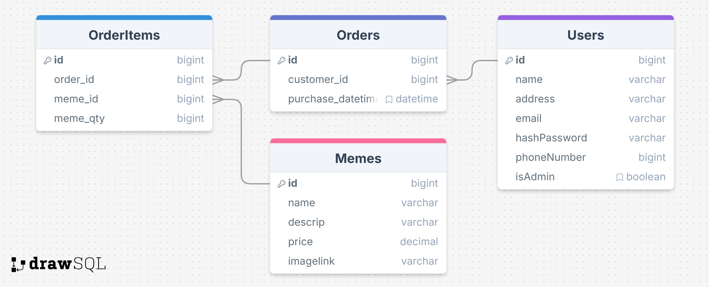

# IM2073 Web Programming Mini-Project: The Cat Meme Shop
Web Mini-Project Repository for NTU IM2073: Intro to Design &amp; Project

## How to start up the WebApp
**Make sure Java(v21), Maven(v3.9.9), MySQL(v8+) and Tomcat(v10) are installed first!**

### For First Time Install
*Assuming you already git cloned this repo into your local machine*  
1. Set up a user account for MySQL with all permissions (Remember these account details!)

2. Run init_db.sql and seed.sql to create tables and rows in MySQL

3. Clone *database.properties-template* file, remove the *-template* and fill in the details with the account details information

4. Create CATALINA_HOME system env variable pointing to Tomcat directory path

5. Change directory to /root

6. Run `mvn clean install` in the console

7. Start up MySQL and Tomcat servers

8. Server will be running on localhost!

## Tech Stack

### Project Management
- Maven (WebApp Archetype) v3.9.9

### Frontend
- Java (Jakarta) Server Pages v4.0.0
- JavaServer Pages Standard Tag Library v3.0.1 + API v3.0.2
- Base CSS & Javascript 

### Backend
- Jakarta Servlets v6.0.0
- MySQL v8.4.4
- MySQL-Connector-Java v9.2.0

### HTTP Server
- Tomcat v10

## MySQL ERD Diagram
> https://drawsql.app/teams/solo-196/diagrams/im2073

## References

### Tags & .jsp templating
> https://stackoverflow.com/questions/1296235/jsp-tricks-to-make-templating-easier

### Passing variables from servlet to .jsp & vice versa
> https://stackoverflow.com/questions/3608891/pass-variables-from-servlet-to-jsp?noredirect=1&lq=1
> https://stackoverflow.com/questions/22374299/passing-variable-from-javascript-to-servlet
> https://stackoverflow.com/questions/18944302/how-do-i-print-the-content-of-httprequest-request

### PreparedStatements & Preventing SQL injections
> https://stackoverflow.com/questions/1812891/java-escape-string-to-prevent-sql-injection
> https://stackoverflow.com/questions/23827120/how-to-fetch-an-id-from-the-database-after-record-inserted-in-db

### JSTL
> https://www.tutorialspoint.com/jsp/jsp_standard_tag_library.htm
> https://stackoverflow.com/questions/4928271/how-to-install-jstl-it-fails-with-the-absolute-uri-cannot-be-resolved-or-una

### Properties file
> https://stackoverflow.com/questions/2161054/where-to-place-and-how-to-read-configuration-resource-files-in-servlet-based-app
> https://mkyong.com/java/java-properties-file-examples/

### java.util.Date, java.sql.Date and java.sql.Timestamp (How to insert Datetime object to MySQL)
> https://stackoverflow.com/questions/3323618/handling-mysql-datetimes-and-timestamps-in-java